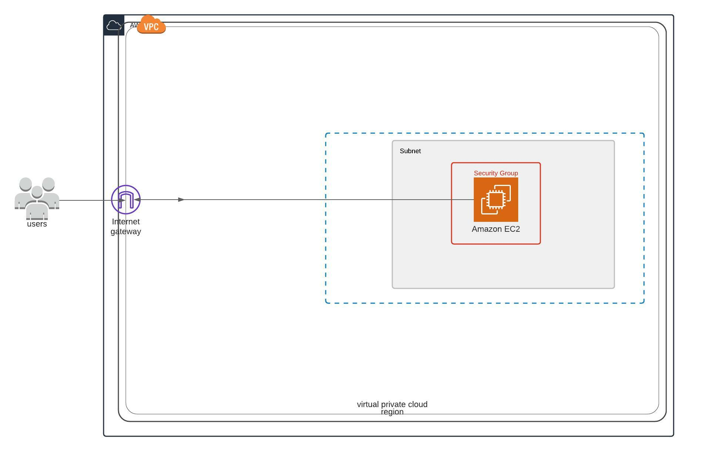

# How to Run

install docker on your machine: [Install Docker](https://docs.docker.com/engine/install/)


Open terminal and run:
```
docker-compose up
```

Open a web browser and navigate to 
```
http://localhost:3000
```


# Application Details

- Web: ASP.NET Core 5.0 Web APP
  - this application requires an environment variabled called "ApiAddress" which will be the address of the Web Api.
- API: ASP.NET Core 5.0 Web API

# Deployment

To deploy, a `Makefile` has been provided that makes the process easy. Navigate to the project root and run the command `make`. The make file contains multiple targets but the default target sets up the infrastructure, and uses ansible to configure the servers when they have been provisioned. There is an `output.sh` script in the scripts folder that takes the server's ip address that Terraform outputs and writes that to an inventory file in the ansible folder along with the location of the private key file and the `ansible_user`.

# Infrastructure

The infrastructure is very straight forward. We have an EC2 instance with a security group to restrict access to just the nginx web server running on port `80`.

The infrastructure is provisioned with Terraform. Terraform, which uses an S3 bucket as a backend and a DynamoDB table for state locking, creates a security group and an EC2 instance. The VPC, internet gateway, subnet and availability zone are all existing resources that we are reusing.

The EC2 instance, when provisioned, is configured with Ansible. Ansible is used to install Docker, Docker compose, Nginx and copy all neccesary files to the server. Nginx is also configured as a `reverse proxy` to route all traffic on port `80` to the frontend on port `3000`
